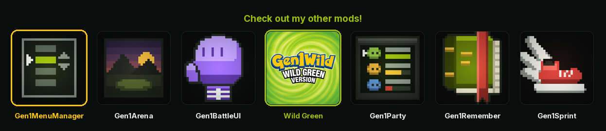

<p align="center">
  <a href="https://wild1walker.github.io/Gen1Wild/"></a>
</p>

<h1 align="center">Gen1MenuManager</h1>

<p align="center">
  <a href="https://wild1walker.github.io/Gen1Wild/"></a>
</p>

<p align="center">
  <b>Your menus, in the order you want them</b>
</p>

Rearrange the START menu and the Pokémon Center PC menu: reorder the rows,
hide the ones you never touch, and pin field items and moves so they get a row
of their own once you own them.

Requires no permissions. The mod manager shows it with a clean permission
list, because nothing here reaches into engine internals.

## Using it

Three ways in, and no arrangement can close all of them:

- press **SELECT** with the START menu or a PC menu open
- pick **MENU MGR**, the row on either menu (and on the SELECT field menu,
  where `SELECT ROW` is on)
- pick **MENU MANAGER** on the OPTION screen, then LEFT and RIGHT for the menu
  you want

SELECT is free in both menus — the START menu's watched-key mask is
`PAD_DOWN | PAD_UP | PAD_START | PAD_B | PAD_A` and the shared menu widget
reads up, down, A, B and START only — so the shortcut takes nothing away from
the vanilla controls.

Each menu keeps its own arrangement. Open the editor from the START menu and
you are editing the START menu; open it from a PC and you are editing that —
and **LEFT and RIGHT walk between them**, which is what makes all three
reachable from the one row on the OPTION screen.

| Button | Does |
| --- | --- |
| Up / Down | move the cursor |
| Left / Right | switch which menu you are arranging |
| A | grab the row, then A again to drop it |
| Up / Down while grabbed | move the row |
| SELECT | show / hide a row, or switch a pin on and off |
| B | leave |

Left and Right are the only keys the editor was not already using. They do
nothing while a row is grabbed: the row is in your hand, and carrying it onto
a different menu is not a move anyone means to make.

### The third menu

The overworld **SELECT** field menu — `FLY`, `TELEPORT`, `FLASH`, `DIG`, a
repel — can be arranged too, where [Gen1WildQOL][qol] is installed and its
`EASY HM USE` is on.

That menu is not the engine's and has no engine hook to wrap, because it is not
a menu with a fixed shape: it is built fresh on every press out of what is
usable on this tile, with this party, in this bag. So that mod publishes a
registry to hand the rows round, and this joins it — the same arrangement as
everywhere else, in the other direction. Everywhere else this mod runs
outermost on a hook so it sees the finished list; there the registry hands it
the finished list directly.

Rows on it carry ids, which the layout already prefers over labels (it does the
same for Gold's PC rows): an id is neither localized nor rewritten when the
bag's best repel changes, and both are true of the labels on that menu.

`CANCEL` is locked there. B closes the menu too, but a way out you can *see* is
not the same as one you have to know about.

Without that mod there is simply no SELECT context — nothing is logged about a
menu you do not have.

[qol]: https://github.com/wild1walker/Gen1WildQOL

The right-hand column reads `ON`, `OFF`, `PIN`, `LOCK` (a row that cannot be
hidden), or `----` for a pin you have not unlocked yet.

## What can be pinned

| Pin | Appears once |
| --- | --- |
| MAP | the TOWN MAP is in the bag |
| BICYCLE | the BICYCLE is in the bag |
| OLD / GOOD / SUPER ROD | that rod is in the bag |
| FLY | a party member knows FLY and you hold the THUNDERBADGE |
| CUT, SURF, STRENGTH, FLASH | a party member knows it and you hold its badge |
| DIG, TELEPORT | a party member knows it |

The TOWN MAP pin is the one row whose label is not the name of the thing it
comes from: it opens the map screen rather than handing you the item, so the
menu row reads `MAP`. The editor still lists it as `TOWN MAP`, under the name
you know it by in the bag. Turn **SHORT NAMES** off and the menu row reads
`TOWN MAP` as well.

ITEMFINDER and the POKé FLUTE are deliberately absent. Their behavior lives
inside the bag's own result dispatch, which is file-local and exported
nowhere; pinning them would mean duplicating engine logic that can drift out
of step. They stay in the bag.

## Options

They all live under the mod's entry in the mod manager.

- **SELECT OPENS** — SELECT opens the editor from either menu. On by default,
  and while it is on the MENU MGR row is an ordinary row you can hide like any
  other. Turn it off and that row locks (`LOCK`), because it becomes the only
  route left.
- **MENU ROW** — show MENU MGR on the START menu.
- **PC ROW** — show MENU MGR on the PC menu.
- **SELECT ROW** — show MENU MGR on the overworld SELECT field menu. **Off** by
  default, unlike the other two: that menu earns its place by being short and
  by being only what is usable where you are standing, and it is arranged from
  the OPTION screen without it.
- **HIDE UNUSABLE** — drop a pin whose action cannot run right now (the
  BICYCLE indoors, SURF facing dry land) instead of showing a row that
  refuses. On by default.
- **SHORT NAMES** — let a pin use this mod's own shorter row name where it
  has one. On by default, and today it is the TOWN MAP row alone, which reads
  `MAP`. Turn it off and every pin goes back to the item or move name the
  game itself uses. The editor lists pins under the game's names either way.

## Notes

- **Other mods' rows are arrangeable too.** The hook runs outermost, so QUESTS,
  ACHIEVEMENTS, NG PLUS and anything else appended by another mod can be moved
  and hidden like a vanilla row.
- **New rows are never lost.** A row the saved order does not mention — a mod
  installed since, or one that only appears with a party — is appended in
  engine order rather than dropped.
- **Layouts follow the save,** and seed from an installation-wide template, so
  a new file starts from your last arrangement instead of from scratch. The
  two menus are stored separately.
- **The PC's exit is never at risk.** The engine appends LOG OFF *after* the
  hook this mod uses, so it cannot be reordered or hidden by anything.
- **Editing a PC menu takes effect immediately.** The PC session stays open
  underneath, so the menu is rebuilt and its box resized when you leave the
  editor.
- **Rows are keyed by label** — except three cases. Rows that carry a stable
  id are keyed by that instead (Gold's PC rows do); the START menu's
  trainer-card row and the PC's `<name>'s PC` row are matched against your
  player name.
- **A renamed row loses its place once.** Two labels change during a
  playthrough: the box PC becomes BILL'S PC when you meet Bill, and a
  translation mod rewrites everything. A key that no longer matches falls to
  the end of the menu, where you can put it back. Nothing is ever dropped.

## Tests

From the root of a gen1recomp checkout, with this mod at
`mods/Gen1MenuManager/`. The suite drives the engine's own Loader, so it does
not run from a bare clone of this repository.

```sh
luajit mods/Gen1MenuManager/tests/Gen1MenuManager_test.lua
```

It runs against the ROM-free fixture dataset, so a checkout with no ROM
imported is fine.

---

## Credits

By **Wild**.

Built on the menu-item hooks of [Pokemon Gen1Recomp](https://github.com/bryanthaboi/gen1recomp), and on the [pret](https://github.com/pret) disassembly of
Pokemon Red, Blue and Yellow: `engine/menus/draw_start_menu.asm` is the menu
this mod reorders, and the row order it ships with is that file's own.
